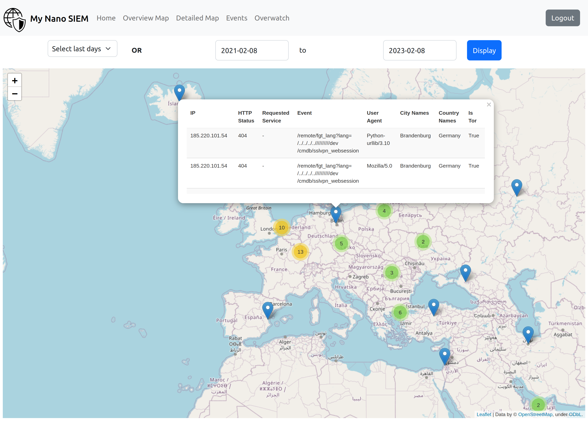
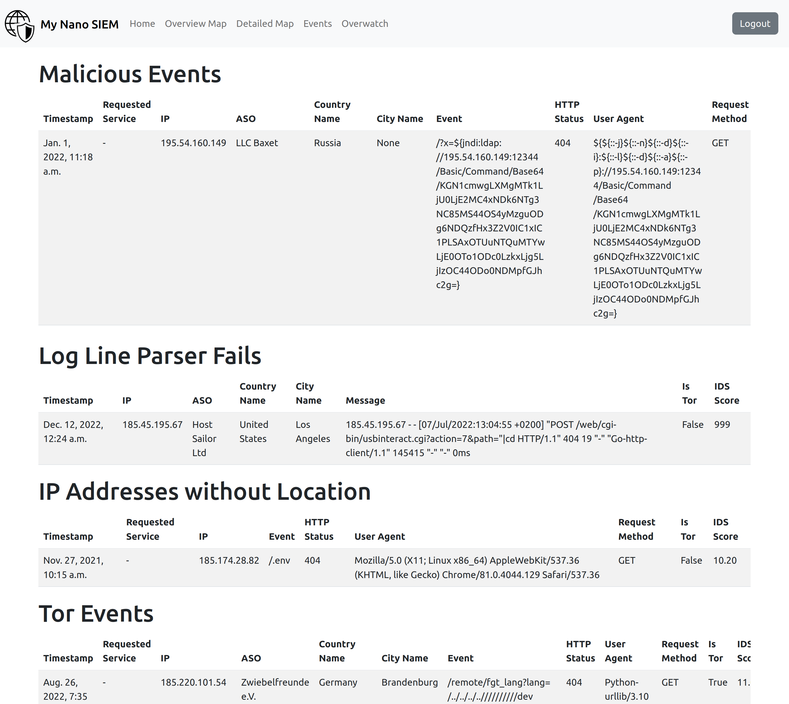

# Nano SIEM

The Nano SIEM project is a minimalistic *security information 
and event management* (SIEM) system designed for private home servers.
This project helps to get an insight into the access log file
of a Traefik reverse proxy. It does this by resolving IPs to
coordinates and displaying them on different map views. In the
screenshot below you can see an example from the detailed map.
On this map, you can click on locations and see the requests that
were made from there. The accesses are ranged by their likelihood
to be a hacking attempt. Furthermore, there is a second view
that specifically lists hacking attempts. A screenshot of this view
can be seen below as well. These functionalities help to get
a better understanding of the server's security risks.

Furthermore, the software is easy to set up and configure.
A prebuild ready-to-use Docker container can be pulled from [Docker Hub](https://hub.docker.com/r/fabianhk/nano-siem).
If you need to parse a different log file format feel free to write
a new plugin and open a pull request.

**Detailed Map View**


**Event View**


# Demo

If you want to check out the implementation with example
data you can go to the [demo/](demo/) folder.
Further instructions how to run the application
can be found there.

# Configuration

Running the application on your own server is quite easy.
You just have to follow the instruction below 
and / or look at the docker-compose file in this
repository. You can pull the ready to use Docker image
from ``docker pull fabianhk/nano-siem``.

## [Required] Django Settings

```bash
DJANGO_SECRET_KEY=<strong secret key with at least 50 characters>
DOMAIN_NAME=<domain name of the server>
```

**Only of debugging:**
If you want to see the logs of the cronjob you have to mount 
a log file to: ``/home/NanoSiem/crontab.log``.

### Database

```bash
MYSQL_DB_NAME=NanoSiem
MYSQL_USER=NanoSiem
MYSQL_PASSWORD=1234
MYSQL_HOST=127.0.0.1
```

```bash
# Run migrations from command line
docker exec -it <container name> python3 manage.py migrate
```

### Authentication

#### OpenID Connect

The OpenID Connect login is tested with the Keycloak authorization server.

```bash
OIDC_CLIENT_ID=<CLIENT_ID>
OIDC_CLIENT_SECRET=<CLIENT_SECRET>

# If this variable is set, the application will use OpenID Connect
# instead of the default Django authentication.
OIDC_DISCOVERY_DOCUMENT=<IDP_URL>/.well-known/openid-configuration
```

#### ALTERNATIVE: Default Django Authentication

If you don't use OpenID Connect for authentication you have to
create a superuser account. You can do this by running the
following command in the container:

```bash
docker exec -it <container name> python3 manage.py createsuperuser
```


## Notification Settings

```bash
NOTIFICATION_EMAIL=<email address>
NOTIFICATION_EMAIL_PASSWORD=<email password>
# The SMTP server has to support STARTTLS
NOTIFICATION_EMAIL_SMTP_SERVER=<smtp server>
```

## Traefik Module

1. Mount Traefik access log to: `/var/log/traefik_access.log`
2. Setup GeoLite2 Free database:
   1. Create an account at [MAXMIND](https://dev.maxmind.com/geoip/geolite2-free-geolocation-data?lang=en)
   2. Create License file: `GeoIP.conf`
   3. Mount license file to: `/etc/GeoIP.conf`

### [Optional] IP Address to Coordinate Config

```bash
# Set default values for private IP addresses (can't be resolved by GeoLite2 db)
PRIVATE_IP_LOCATION_INFO=65.01236,25.46816,Oulu,Finland,DNA 
```

## Overwatch Module

The Overwatch module checks whether a service is available or not
every minute. If a service is not available the module will send
an email notification to the configured email address (Requires
the notification settings to be configured).
You can configure as many services as you want
by increasing the numbers at the end of the environment variable.
The pair of name and type has to be unique. The type can be one of
the following: ``http``, ``tcp``, ``ping`` or ``disk``.

```bash
# HTTP example
OVERWATCH_0=Name,http,https://example.com
OVERWATCH_{i}=Name,http,<url>

# TCP example
OVERWATCH_1=Name,tcp,example.com,22
OVERWATCH_{i}=Name,tcp,<domain/ip>,<port>

# Ping
OVERWATCH_2=Name,ping,example.com
OVERWATCH_{i}=Name,ping,<domain/ip>

# Disk
OVERWATCH_3=Name,disk,/dev/sda1,/media/usb,58d775d2-1fcb-4d10-aee5-cb956a86abd3
OVERWATCH_{i}=Name,disk,<device>,<mount point>,<uuid>
```

**Notes on the disk availability check:** You have to mount the root filesystem
to ``/mnt/rootfs`` as a read-only filesystem.

## All Configuration Options

You can find all configuration options in the file [configuration.md](doc/configuration.md).
